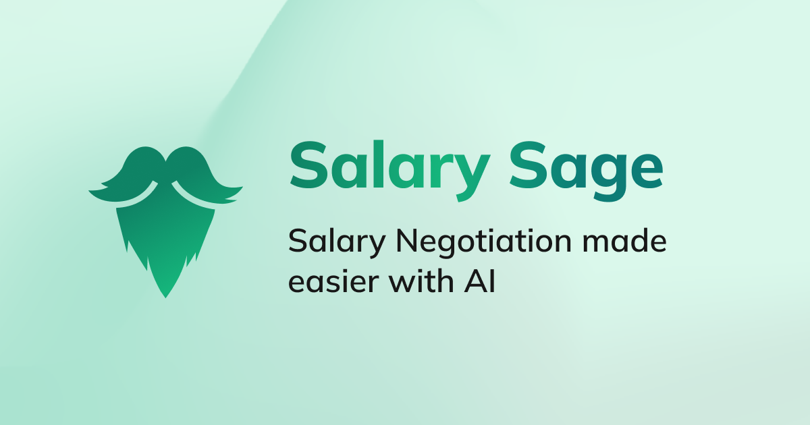

# Salary Sage


https://salary-sage.vercel.app/

Salary Sage is an AI-powered web app that helps you practice negotiating your salary. It uses GPT-3.5 and GPT-4 to realistically mock an interviewer, provides hints if you are stuck, and gives detailed feedback on your performance.

It is built with Next.js, Supabase, and Tailwind CSS.

## Team Members
| Name | Matric Number | Github | Contributions |
| ---- | ------------- | ------ | ---- |
| Charisma Kausar | A0226593X | @ckcherry23 | Frontend + UI/UX |
| Dexter Leng | A0273293Y | @dexterleng | Fullstack |
| Sherwin | A0218177Y | @sherrpass | Prompt Engineering + Backend |
| Quan Teng Foong | A0223929X | @kaldius | Backend |


## Setup instructions

1. Clone the Repo
2. Configure Supabase:
  - Install Docker Desktop
  - Under Settings -> Advanced:
    - System
  - Allow the default Docker socket to be used
3. supabase link
4. supabase start
4. Create .env. local in project root:
```
NEXT_PUBLIC_SUPABASE_URL=
NEXT_PUBLIC_SUPABASE_ANON_KEY=
GOOGLE_SERVICE_ACCOUNT_JSON=
OPENAI_API_KEY=
INVITE_CODE=
```
5. Start the project: vercel dev

> Check out [the docs for Local Development](https://supabase.com/docs/guides/getting-started/local-development) to also run Supabase locally.

## Resources
* Tech Offers Repo - salary data
* shadcn/ui - basic UI components
